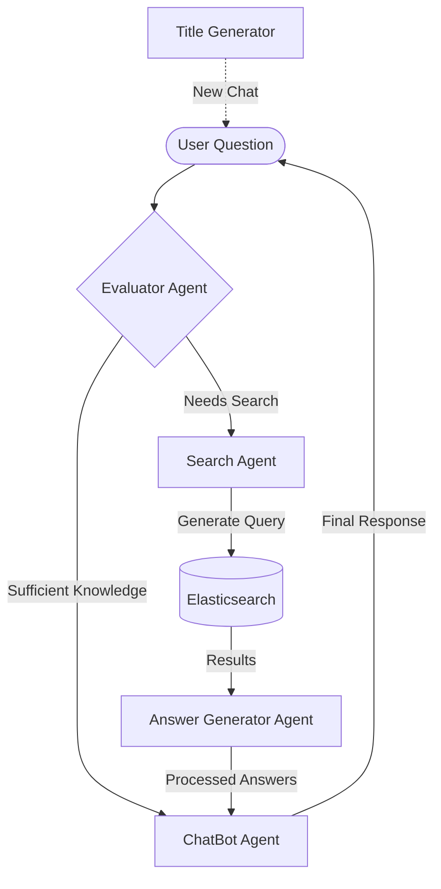
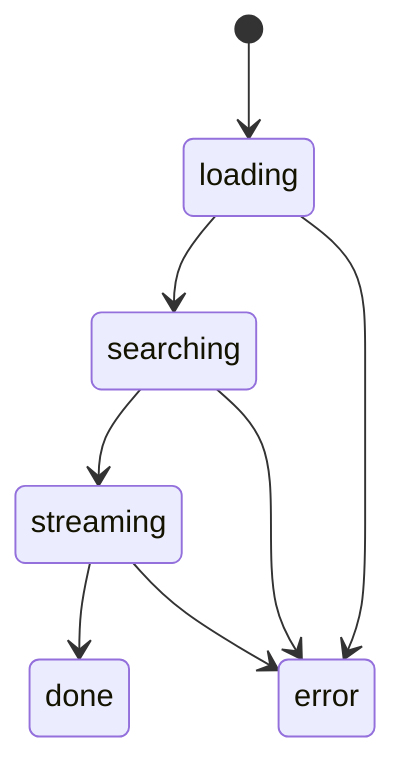

# 🤖 LLM Agents Documentation

## Overview

The system uses multiple specialized LLM agents that work together to process legal document queries. Each agent has a specific role and communicates with others in a defined workflow.

## Agent Interaction Flow



## 🎯 Agent Roles & Prompts

### 1. Evaluator Agent
**Purpose**: Determines if the question needs document search or can be answered with existing knowledge
**Model**: gemini-2.0-flash-lite
**Temperature**: 0.2

```yaml
Input: User question history
Output: JSON with:
  - is_sufficient: boolean
  - questions: string[]
Key Features:
  - Analyzes question complexity
  - Determines need for document search
  - Breaks down complex questions
```

### 2. Search Agent
**Purpose**: Converts natural language questions into Elasticsearch queries
**Model**: gemini-2.0-flash
**Temperature**: 0.2

```yaml
Input: List of questions
Output: Elasticsearch query JSON
Features:
  - Advanced query construction
  - Multiple fallback strategies
  - Field-specific boosting
  - Nested query support
```

### 3. Answer Generator Agent
**Purpose**: Processes search results to generate structured answers
**Model**: gemini-2.0-flash
**Temperature**: 0.2

```yaml
Input: 
  - Search results
  - Original questions
Output: JSON with:
  - is_sufficient: boolean
  - answers: Array of Q&A pairs
Features:
  - Document synthesis
  - Citation handling
  - Answer structuring
```

### 4. ChatBot Agent (Main Response Agent)
**Purpose**: Generates final, user-friendly responses
**Model**: gemini-2.0-flash
**Temperature**: Default

```yaml
Input:
  - User history
  - Processed answers
  - Document citations
Output: Natural language response
Features:
  - Indonesian language output
  - Markdown formatting
  - Citation linking
  - Legal explanation
```

### 5. Title Generator Agent
**Purpose**: Creates chat session titles
**Model**: gemini-2.0-flash-lite
**Temperature**: Default
**Max Tokens**: 500

```yaml
Input: Initial user question
Output: Short, descriptive title
Features:
  - Concise summarization
  - Topic extraction
  - Format cleaning
```

## 🔄 Processing Flow

1. **Initial Evaluation**
   ```mermaid
   sequenceDiagram
       User->>Evaluator: Ask Question
       Evaluator->>Evaluator: Analyze Complexity
       Evaluator-->>SearchAgent: Generate Search Questions
       alt No Search Needed
           Evaluator->>ChatBot: Direct Response
       end
   ```

2. **Document Search**
   ```mermaid
   sequenceDiagram
       SearchAgent->>ES: Execute Query
       ES-->>SearchAgent: Return Documents
       alt No Results
           SearchAgent->>SearchAgent: Try Fallback
       end
   ```

3. **Answer Generation**
   ```mermaid
   sequenceDiagram
       AnswerGen->>AnswerGen: Process Documents
       AnswerGen->>AnswerGen: Extract Relevant Info
       AnswerGen->>ChatBot: Structured Answers
   ```

4. **Response Generation**
   ```mermaid
   sequenceDiagram
       ChatBot->>ChatBot: Format Response
       ChatBot->>ChatBot: Add Citations
       ChatBot->>User: Final Answer
   ```

## 🛠️ Implementation Details

### Error Handling
- Each agent has retry mechanisms
- Exponential backoff for failed attempts
- Fallback strategies for searches
- Graceful degradation of service

### State Management


### Message Flow Control
- RabbitMQ for async processing
- Supabase for state persistence
- Streaming responses for real-time updates

## 📝 Code Example

Key interaction point in chat_consumer.py:
```python
# Question Processing Flow
1. __init_evaluation()         # Evaluator Agent
2. __generate_and_execute_es_query()  # Search Agent
3. __answer_generated_questions()      # Answer Generator
4. __answer_user()            # ChatBot Agent
```

## 🔍 Debugging Tips

1. Each agent logs extensively
2. State transitions are tracked
3. Full error tracebacks available
4. Performance metrics for each step

## 📈 Performance Considerations

- Caching opportunities
- Retry strategies
- Timeout handling
- Error recovery
- Response streaming

## 🔐 Security Notes

- No prompt exposure to users
- Sanitized error messages
- Protected credentials
- Rate limiting
