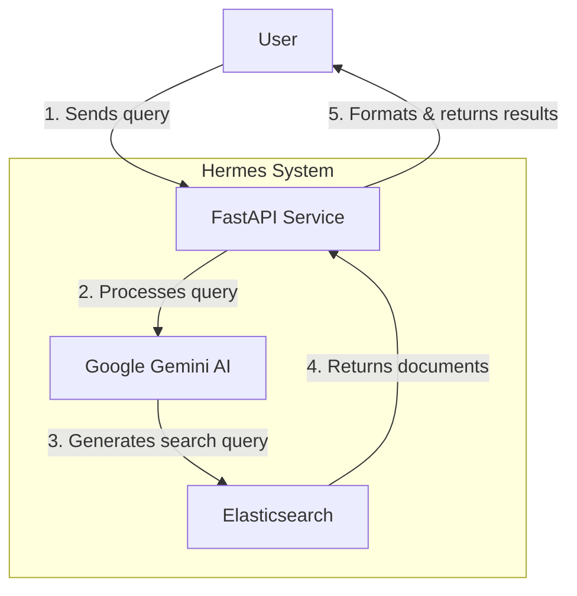
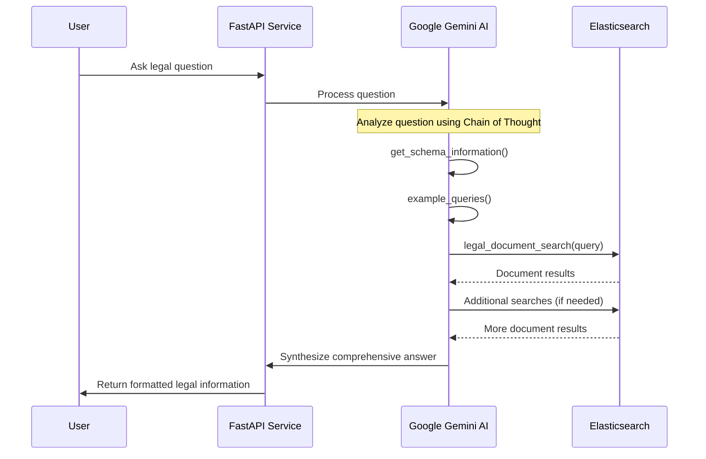

# Hermes - Lexin Legal Document Search System

Hermes is a specialized service within the Lexin chat-monorepo that provides legal document search capabilities through a sophisticated AI interface. It uses Google's Gemini AI models to process natural language queries and convert them into structured Elasticsearch queries for retrieving Indonesian legal documents.

## 📋 Table of Contents

- [Overview](#overview)
- [Architecture](#architecture)
- [Environment Variables](#environment-variables)
- [Tools and Components](#tools-and-components)
- [System Flow](#system-flow)
- [API Endpoints](#api-endpoints)
- [Deployment](#deployment)
- [Development](#development)

## 🔭 Overview

Hermes serves as the search backbone for Lexin, a legal information assistant focused on Indonesian law. It processes user queries about legal matters and searches through a comprehensive database of legal documents, including laws, regulations, and other legal texts.

## 🏗️ Architecture



## 🔐 Environment Variables

| Variable Name     | Description                          | Expected Format         |
|-------------------|--------------------------------------|-------------------------|
| `GENAI_API_KEY`   | Google Gemini AI API key             | String                  |
| `ELASTICSEARCH_HOST` | Elasticsearch host                | String (default: "elasticsearch") |
| `ELASTICSEARCH_PORT` | Elasticsearch port                | Integer (default: 9200) |
| `ELASTICSEARCH_USER` | Elasticsearch username (optional) | String                  |
| `ELASTICSEARCH_PASSWORD` | Elasticsearch password (optional) | String              | 
| `RABBITMQ_HOST`   | RabbitMQ host for messaging          | String (default: "rabbitmq") |
| `HTTP_PROXY`      | HTTP proxy settings                  | URL                     |
| `HTTPS_PROXY`     | HTTPS proxy settings                 | URL                     |
| `NO_PROXY`        | No proxy settings                    | Comma-separated list    |

## 🧰 Tools and Components

### Search Engine

The system uses Elasticsearch to index and search through legal documents with a specialized schema:

- **Metadata**: Document type, title, number, year, status, etc.
- **Relations**: Document relationships (amends, revokes, etc.)
- **Content**: Full text of legal documents
- **Abstracts**: Document summaries
- **Notes**: Additional information about the documents

### AI Components

- **Query Processing**: Google Gemini 2.0 Flash model processes natural language questions
- **Tool Calling**: The AI uses specialized tools to:
  - Search legal documents
  - Get schema information
  - Access example queries

## 🔄 System Flow



### Search Process

1. **Query Analysis**: The system analyzes the user's legal question
2. **Query Generation**: Converts to structured Elasticsearch query
3. **Document Retrieval**: Fetches relevant legal documents
4. **Relationship Tracking**: Examines document relationships
5. **Information Synthesis**: Compiles comprehensive answer

## 🚢 Deployment

Hermes is containerized using Docker and includes the following configuration:

- Python 3.12.3 base image
- Two-stage build for smaller image size
- Non-privileged user for security
- Environment variables for proxy settings
- Exposed port 8000 for the FastAPI application
- Multiple workers (4) for handling concurrent requests

## 💻 Development

### Installation

```bash
# Clone the repository
git clone https://github.com/your-org/lexin-chat-monorepo.git

# Navigate to the hermes directory
cd lexin-chat-monorepo/hermes

# Install dependencies
pip install -r requirements.txt

# Run the application
uvicorn src.app.main:app --host 0.0.0.0 --port 8000 --reload
```

### Project Structure

```
hermes/
├── src/
│   ├── app/
│   │   └── main.py         # Main FastAPI application entry point
│   ├── config/
│   │   └── llm.py          # LLM configuration and prompts
│   └── tools/
│       ├── toolcall.py     # Tool calling implementation for Gemini
│       └── search_legal_document.py  # Elasticsearch search functionality
├── requirements.txt        # Python dependencies
├── Dockerfile              # Docker configuration
└── README.md               # This documentation
```

### Key Components

- **FastAPI Application**: Handles HTTP requests and responses
- **Google Gemini Integration**: Processes natural language and generates structured queries
- **Elasticsearch Client**: Searches the legal document database
- **System Prompts**: Guide the AI's behavior for legal search and response generation
