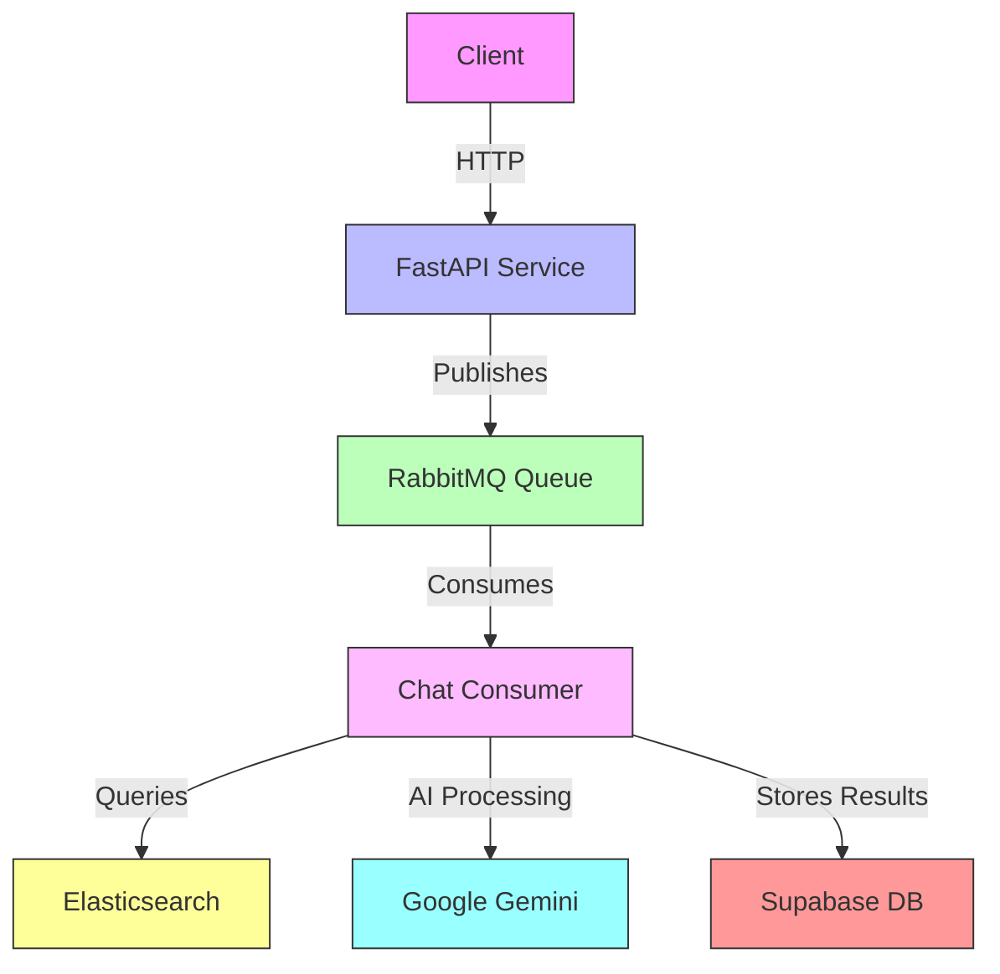
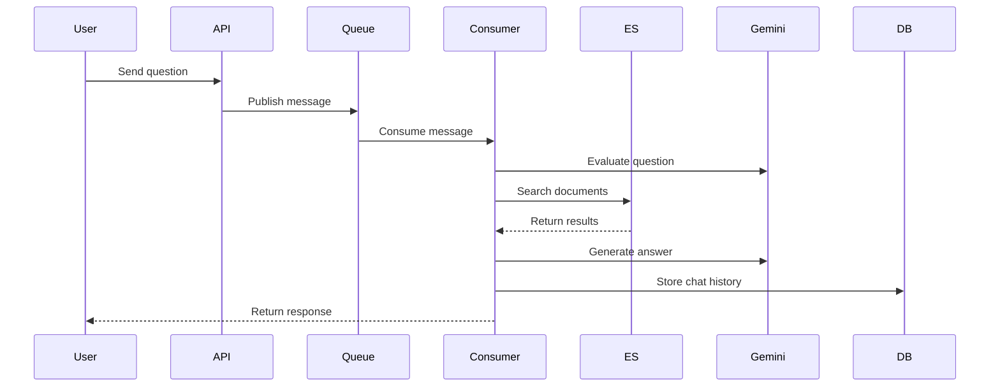
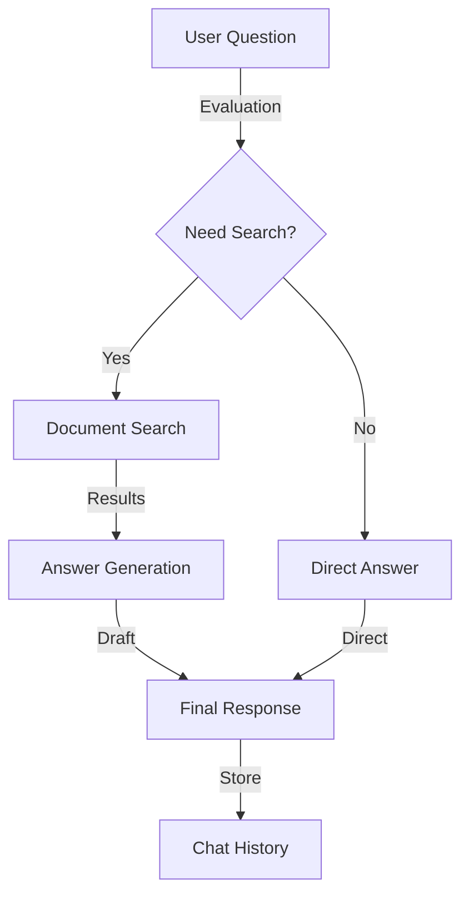

# 🤖 Hermes - Legal Document Search Assistant

A Python-based AI assistant for searching and analyzing Indonesian legal documents using Elasticsearch and Google's Gemini model.

## 📚 Project Overview

Hermes is a sophisticated legal document search and analysis system that combines:
- Elasticsearch for legal document storage and retrieval
- Google's Gemini model for natural language understanding
- RabbitMQ for message queuing
- Supabase for user data and chat history
- FastAPI for the REST API interface

## 🔐 Environment Variables

| Variable | Description | Format |
|----------|-------------|---------|
| `ELASTICSEARCH_URL` | Elasticsearch endpoint | `https://host:port/index` |
| `ELASTICSEARCH_USER` | Elasticsearch username | String |
| `ELASTICSEARCH_PASSWORD` | Elasticsearch password | String |
| `GENAI_API_KEY` | Google Gemini API key | String |
| `RABBITMQ_HOST` | RabbitMQ server host | String |
| `RABBITMQ_USER` | RabbitMQ username | String |
| `RABBITMQ_PASS` | RabbitMQ password | String |

## 🏗️ System Architecture



## 🔄 Message Flow



## 📁 Project Structure

```
hermes/
├── src/
│   ├── tools/
│   │   ├── search_legal_document.py  # Elasticsearch search functionality
│   │   └── toolcall.py              # Gemini tool integration
│   ├── consumer/
│   │   └── chat_consumer.py         # RabbitMQ message consumer
│   ├── config/
│   │   └── llm.py                   # LLM configuration and prompts
│   ├── common/
│   │   ├── gemini_client.py         # Gemini API client
│   │   └── supabase_client.py       # Supabase client
│   └── model/
│       └── search.py                # Data models
└── requirements.txt                 # Project dependencies
```

## 🔍 Core Components

### Legal Document Search

The search system uses a sophisticated fallback strategy:
1. Primary search with exact query
2. Relaxed boolean search
3. Multi-field fuzzy search
4. Broad query string search
5. Recent documents as fallback

### Question Processing



## 🛠️ Setup & Installation

1. Install dependencies:
```bash
pip install -r requirements.txt
```

2. Configure environment variables (see table above)

3. Start the RabbitMQ consumer:
```bash
python -m src.consumer.chat_consumer
```

## 📝 API Documentation

### Chat Endpoint

Processes user questions and returns AI-generated responses with legal document citations.

**Request:**
```json
{
    "messages": [{"role": "user", "content": "Question text"}],
    "session_uid": "session-id",
    "user_uid": "user-id",
    "access_token": "jwt-token",
    "refresh_token": "refresh-token"
}
```

**Response:**
```json
{
    "content": "AI response with citations",
    "documents": ["Referenced legal documents"],
    "state": "done"
}
```

## 🤝 Contributing

1. Follow Python code style guidelines
2. Add comprehensive docstrings
3. Test thoroughly before submitting PRs
4. Update documentation as needed
